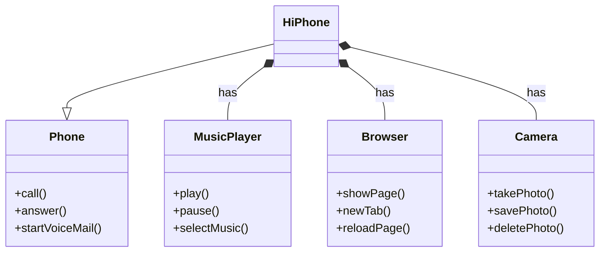

# HiPhone
Modelando o iPhone (ou HiPhone) com UML: Funções de Músicas, Chamadas e Internet

## Documentação da API (Swagger)

## Classes:

+ Phone: Representa um telefone básico com as funcionalidades essenciais de um telefone.
+ HiPhone: Extende a classe Phone, representando um modelo específico de telefone (HiPhone) com funcionalidades adicionais.
+ MusicPlayer: Responsável por controlar a reprodução de música.
+ Browser: Responsável por navegar na internet.
+ Camera: Responsável por tirar e gerenciar fotos.

## Relações:

+ Herança: HiPhone herda todas as propriedades e métodos da classe Phone. Representado pela seta com um triângulo vazio.
+ Agregação: HiPhone tem um MusicPlayer, um Browser e uma Camera. Representado pela seta com um losango. Isso indica que o HiPhone utiliza esses componentes, mas eles podem existir independentemente do HiPhone.
